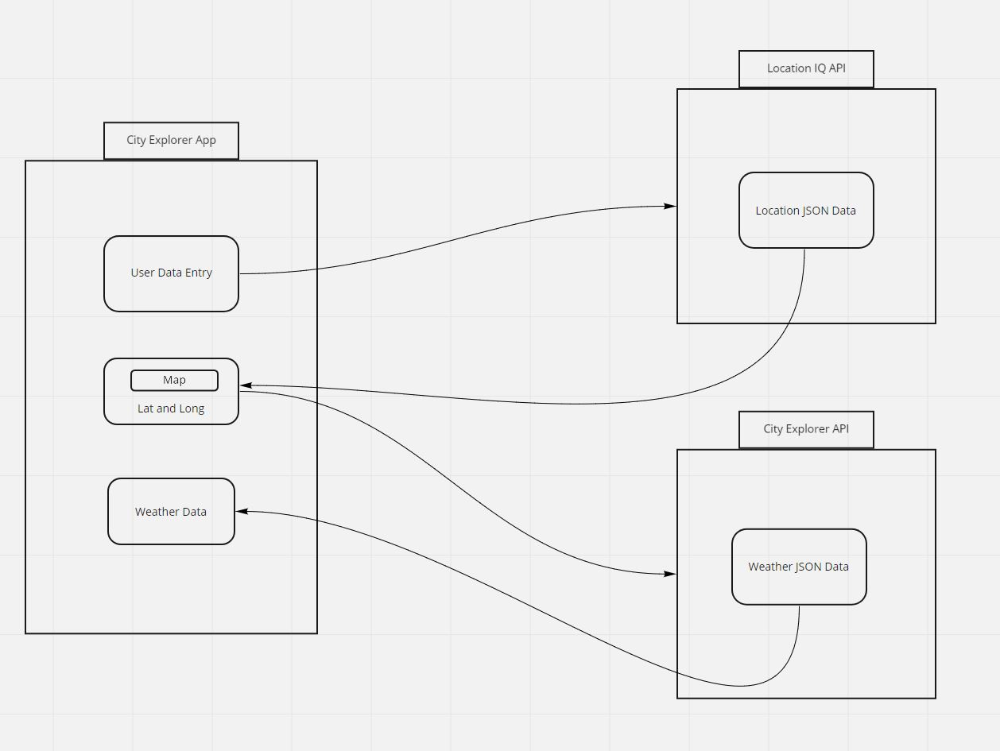

# city-explorer-api

**Author**: Kellen Linse
**Version**: 1.1.0 (increment the patch/fix version number if you make more commits past your first submission)

## Overview

Express server demo, serves dummy weather data to city-explorer app
<!-- Provide a high level overview of what this application is and why you are building it, beyond the fact that it's an assignment for this class. (i.e. What's your problem domain?) -->

## Getting Started

Please see the .sample.env file for how to set up your PORT
<!-- What are the steps that a user must take in order to build this app on their own machine and get it running? -->

## Architecture
This application utilizes the Node.js Express.js dotenv and cors libraries
<!-- Provide a detailed description of the application design. What technologies (languages, libraries, etc) you're using, and any other relevant design information. -->

## Change Log

Version 1.1.0 - 12/07/2021 - Application now has a fully-functional express server, with a GET route for the location resource.
<!-- Use this area to document the iterative changes made to your application as each feature is successfully implemented. Use time stamps. Here's an example:

01-01-2001 4:59pm - Application now has a fully-functional express server, with a GET route for the location resource. -->

## Credit and Collaborations

Data diagram created in cooperation with Beau Hibbert
<!-- Give credit (and a link) to other people or resources that helped you build this application. -->

## Time Estimate 1

Name of feature: Feature 1

Estimate of time needed to complete: .25hrs

Start time: 4:00

Finish time: 4:15

Actual time needed to complete: .25hrs

## Time Estimate 2

Name of feature: Feature 2 & 3

Estimate of time needed to complete: 3hrs

Start time: 4:30

Finish time: 8:00

Actual time needed to complete: 3.5hrs